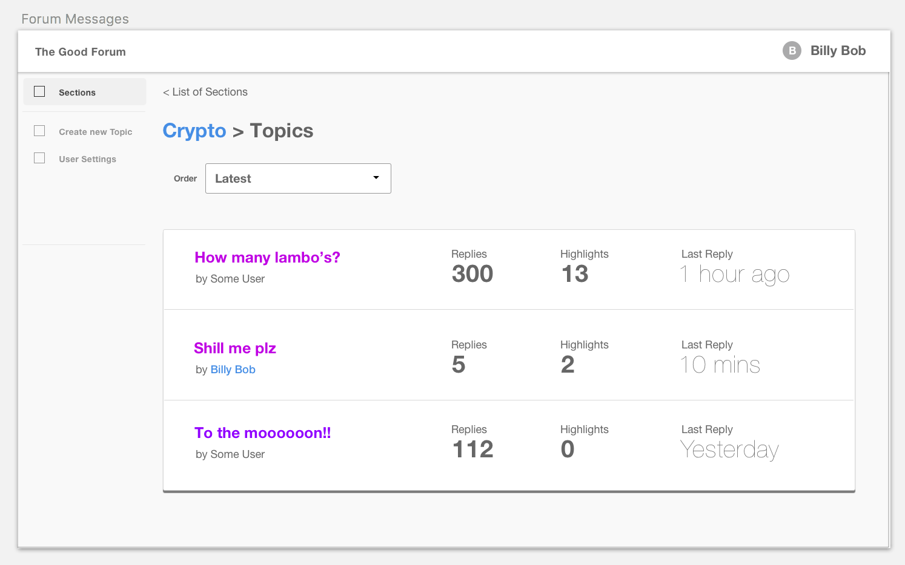

# REX Backend Test

## Overview 

The Good Forum (tm) is an API application built based on [Laravel 5.6](https://laravel.com/).
It was hastily built by some Junior developers, and it needs a little bit of love.
We would like you to help improve this application by completing the tasks outlined below.

This API will be utilised by a React frontend. 



## Installation
### Requirements

- PHP 7.0
- Postgresql or MySQL

###

To setup this project you have to clone it from the github repository

```
git clone https://github.com/wendelldecatoria/forum-api.git
```

### Configure

```bash
cp .env.example .env
```

for the Media library to work you have to run

```
php artisan storage:link
```

Edit the `.env` file to update database credentials

### Install dependencies

```bash
composer install
```

### Run tests

```bash
composer tests
```

### Run application

```bash
php artisan serve
```

Application available from: `http://localhost/`

### Access the API

The API is RESTful:

#### Sections

Sections contain topics. Each section breaks the forum up into logically grouped areas. Eg. the "Crypto" section.

- List of sections: `GET /api/v1/sections`
- Retrieve section: `GET /api/v1/sections/{id}`
- Create a new section: `POST /api/v1/sections`
- Update a section: `PATCH /api/v1/sections/{id}`
- Delete a section: `DELETE /api/v1/sections/{id}`

#### Topics

Topics group together messages within a section.  An example topic in the "Crypto" section might be "I just mortgaged 
my house and now BTC is only worth 3k :scream:".

- List of topics: `GET /api/v1/topics`
- Retrieve topic: `GET /api/v1/topics/{id}`
- Create a new topic: `POST /api/v1/topics`
- Update a topic: `PATCH /api/v1/topics/{id}`
- Delete a topic: `DELETE /api/v1/topics/{id}`
- Get topic thread: `GET /api/v1/topics/{id}/thread`

#### Messages

Messages are created within a topic and may have a parent_id for nested relationships.

- List of messages: `GET /api/v1/messages`
- Retrieve message: `GET /api/v1/messages/{id}`
- Create a new message: `POST /api/v1/messages`
- Update a message: `PATCH /api/v1/messages/{id}`
- Delete a message: `DELETE /api/v1/messages/{id}`
- Retrieve List of message belonging to a topic `GET /api/v1/topics/{id}/messages`

#### Users

Users are the entities within the system that can create messages, and topics.

- List of users: `GET /api/v1/users`
- Retrieve user: `GET /api/v1/users/{id}`
- Create/register a new user: `POST /api/v1/users`
- Update a user: `PATCH /api/v1/users/{id}`
- Delete a user: `DELETE /api/v1/users/{id}`
- Retrieve user profile: `GET /api/v1/users/{id}/profile`
- Update user profile: `PATCH /api/v1/users/{id}/profile`

